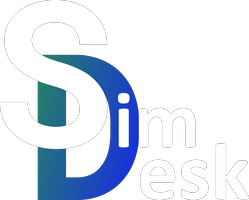

<p align="center">
    
</p>
<p align="center">
    <em>Server leaderboard and tools for Assetto Corsa Competizione</em>
</p>

# Features

- ✅ Leaderboard for lap records
- ✅ session overview
- ✅ Balance of Performance overview with management interface
- ✅ Entrylist validator
- ✅ Balance of Performance Editor
- ✅ Discord integration

# Quick Start

🐳 Docker

```bash
docker run -d --restart=always -p 8085:8080 --name simdesk -v ./results:/app/results -v ./data:/app/data fabieu/simdesk:latest
```

🐳 Docker Compose

```yaml
services:
  app:
    image: fabieu/simdesk:latest
    ports:
      - "8080:8080"
    volumes:
      - ./data:/app/data
      - ./results:/app/results
    restart: unless-stopped
```

```bash
docker-compose up -d  
```

# Configuration

For additional configuration options, please refer to the **official documentation**: https://simdesk.eu.

# Changelog & Releases

This repository keeps a changelog using GitHub's releases functionality.

Releases are based on Semantic Versioning, and use the format of `MAJOR.MINOR.PATCH`. In short, the version will be
incremented based on the following:

- `MAJOR`: Incompatible or major changes.
- `MINOR`: Backwards-compatible new features and enhancements.
- `PATCH`: Backwards-compatible bugfixes and package updates.

# Contributing

Contributions are what make the open source community such an amazing place to learn, inspire, and create. Any
contributions you make are **greatly appreciated**.

If you have a suggestion that would make this better, please fork the repo and create a pull request. You can also
simply open an issue with the tag "enhancement".
Don't forget to give the project a star! Thanks again!

1. Fork the Project
2. Create your Feature Branch (`git checkout -b feature/AmazingFeature`)
3. Commit your Changes (`git commit -m 'Add some AmazingFeature'`)
4. Push to the Branch (`git push origin feature/AmazingFeature`)
5. Open a Pull Request

# License

This project is licensed under the terms of the Apache License 2.0.

# Built With

[![Spring Boot][spring-boot]][spring-boot-url]
[![Vaaadin][vaadin]][vaadin-url]

[project-url]: https://github.com/fabieu/simdesk

[issues-url]: https://github.com/fabieu/simdesk/issues

[forks-url]: https://github.com/fabieu/simdesk/forks

[spring-boot]: https://img.shields.io/badge/spring%20boot-6DB33F?logo=springboot&logoColor=white&style=for-the-badge

[spring-boot-url]: https://spring.io/projects/spring-boot

[vaadin]: https://img.shields.io/badge/vaadin-00B4F0?logo=vaadin&logoColor=white&style=for-the-badge

[vaadin-url]: https://vaadin.com/